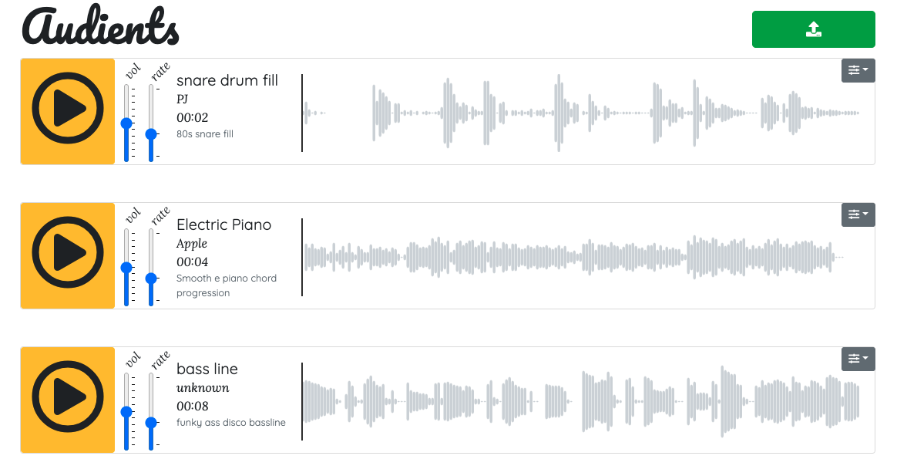

# audients
An audio-sample sharing app built with React, using PostgreSQL, and Cloudinary for audio file storage.

Users can upload and delete audio, view clips' waveforms, and play clips simultaneously while adjusting volume, playback rate, and looping status.

### Setup

cd into `/server` and run `npm install`
then `npm start`

cd into `/client` and run `npm install`
then `npm start`

This app is still in development, with more features and functionality to be added.
